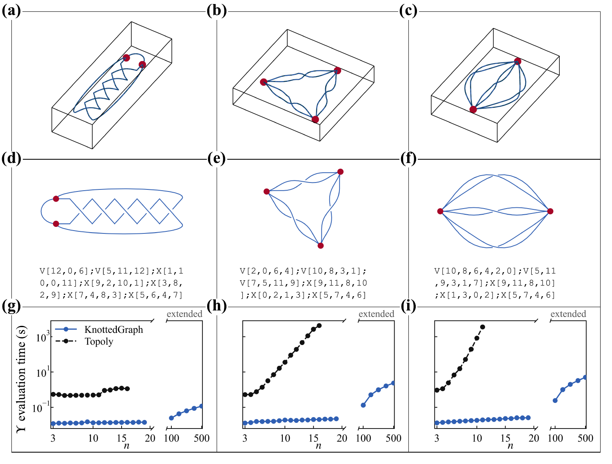
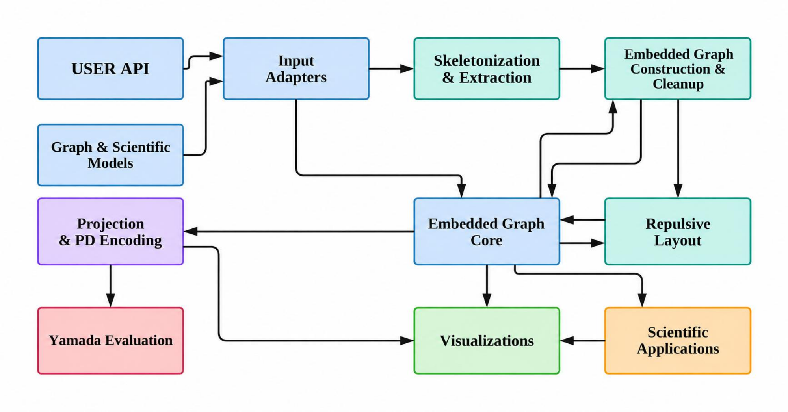

# KnottedGraph


[](https://pypi.org/project/knotted_graph/)
[](https://hakanakgn.github.io/KnottedGraph/)

**KnottedGraph turns geometric, graph, knot-field, and Hamiltonian-derived
objects into inspectable spatial graphs, planar diagrams, and Yamada
polynomials.** It separates the reusable graph/projection/invariant core from
optional scientific applications such as nodal skeletons, analytic knot
fields, material surfaces, and repulsive layouts.

**[Website](https://hakanakgn.github.io/KnottedGraph/)** ·
**[Paper figures and downloadable data](https://hakanakgn.github.io/KnottedGraph/paper_results.html)** ·
**[Quick Start](https://hakanakgn.github.io/KnottedGraph/quickstart.html)**

## Please cite our work

If you use KnottedGraph, please cite **[KnottedGraph: Scalable knotted-graph topology
for scientific and mathematical discovery](https://arxiv.org/abs/2609.31152)**
(Akgün, Yan, Liu, Chen and Lee, 2026).

For scientific applications to handlebody topology, Fermi-surface dispersions,
Lifshitz transitions and topological phase maps, please also cite
**[Topological classification through knotted graphs: Fermi surface dispersions
and Lifshitz transitions](https://arxiv.org/abs/2609.13390)**
(Akgün, Yan and Lee, 2026).

Copy the entries below, or [download the BibTeX file](CITATION.bib).

```bibtex
@misc{akgun2026knottedgraph,
  title={KnottedGraph: Scalable knotted-graph topology for scientific
         and mathematical discovery},
  author={Hakan Akgün and Xianquan Yan and Kehan Liu
          and Zhaoyun Chen and Ching Hua Lee},
  year={2026},
  eprint={2609.31152},
  archivePrefix={arXiv},
  primaryClass={cs.MS},
  url={https://arxiv.org/abs/2609.31152}
}

@misc{akgun2026topologicalclassificationknottedgraphs,
  title={Topological classification through knotted graphs:
         Fermi surface dispersions and Lifshitz transitions},
  author={Hakan Akgün and Xianquan Yan and Ching Hua Lee},
  year={2026},
  eprint={2609.13390},
  archivePrefix={arXiv},
  primaryClass={cond-mat.mes-hall},
  url={https://arxiv.org/abs/2609.13390}
}
```

## Explore the paper and its data

**[Open the online figure and data gallery](https://hakanakgn.github.io/KnottedGraph/paper_results.html)**
to view the paper's figures and download their supporting records directly
below each figure. No notebook execution is needed to browse the data.

| Explore | Direct entry point |
| --- | --- |
| All four main figures and eleven supplementary figures | [Online gallery](https://hakanakgn.github.io/KnottedGraph/paper_results.html) · [Repository guide](doc/paper_results.md) |
| Figure 4 and Supplementary Figure 10: 459 mixed-family cases, 324 short braid words and two length-101 checks | [Browse CSV/JSON data](User_guide/applications/results/figure4_suppfig10/README.md) · [Download complete data and source ZIP](doc/assets/data/figure4-suppfig10-source-data.zip) |
| Runtime comparisons and 4,400 handlebody cases | [Benchmark CSVs and interpretation](https://hakanakgn.github.io/KnottedGraph/benchmarks.html) |
| Small correctness checks with commands and expected results | [Sanity checks](https://hakanakgn.github.io/KnottedGraph/sanity_checks.html) |

Check the saved records without rerunning a scientific calculation:

```bash
uv run --no-project python scripts/inspect_paper_data.py
```

This standard-library command verifies file hashes and case alignment, then
summarizes the **112 saved scaling cases**, **4,400 handlebody cases**, and
the **Figure 4 / Supplementary Figure 10 data**.
See the [data inventory](User_guide/benchmarks/results/README.md) for direct CSV
links, timing definitions and the availability of the formula-discovery records.

### Published results at a glance

| Paper result | Saved evidence | Read the figure |
| --- | --- | --- |
| Exact published-polynomial checks through 500 crossings; 112 saved cases | [Scaling CSV](User_guide/benchmarks/results/03_knottedgraph_vs_topoly_scaling_rows.csv) | [Figure 3 and timing protocol](doc/benchmarks.md) |
| Normalized Yamada preserved in 4,400 accepted handlebody cases | [Preservation CSV](User_guide/benchmarks/results/handlebody_ground_truth/synthetic_ground_truth_yamada_preservation.csv) | [Supplementary Figures 6–7](doc/paper_results.md) |
| Per-stage timings with completed/timeout/error status retained | [Timing-figure CSV](User_guide/benchmarks/results/04_thick_handlebody_time_distribution_plot_source.csv) | [CSV columns and comparison rules](doc/benchmarks.md) |
| Formula and coefficient comparisons for mixed families and ordered braid words | [Figure 4 / Supplementary Figure 10 data](User_guide/applications/results/figure4_suppfig10/README.md) | [Figure panels and downloads](https://hakanakgn.github.io/KnottedGraph/paper_results.html#figure-4-discovering-and-testing-family-laws) |

[](https://hakanakgn.github.io/KnottedGraph/paper_results.html#figure-3-exact-evaluation-through-500-crossings)

*Figure 3 from [arXiv:2609.31152v1](https://arxiv.org/abs/2609.31152v1).
Open the [figure guide](doc/paper_results.md) for all 15 original PDFs, method
links and the availability of each result dataset.*

## Version and installation

This repository provides the **0.2.0 development API** on `main`.
The legacy 0.1.2 PyPI release uses a different, nodal-only API; install from
source for the examples below. The website is built from `main`; see the
[installation guide](doc/installation.md) for dependencies and version checks.

## Start here

Choose the row that matches the object you already have:

| I have / I want | First entry point | Continue to |
| --- | --- | --- |
| No existing data; I want a five-minute test | [`examples/quickstart.py`](examples/quickstart.py) | [Quick Start](doc/quickstart.md) |
| Ordered coordinates or CSV/DAT/JSON/NPY/TSV/TXT/XYZ | `knotted_graph.inputs.from_coordinate_chain` | [Input handling](doc/user_guide/input_adapters.md) |
| A PDB/mmCIF backbone | `from_pdb_backbone` / `from_mmcif_backbone` | [Input handling](doc/user_guide/input_adapters.md) |
| A GRO snapshot or first LAMMPS frame | `from_gromacs_gro` / `from_lammps_dump` | [Input handling](doc/user_guide/input_adapters.md) |
| Node and edge CSV files for a spatial graph | `from_spatial_graph_csv` | [Input handling](doc/user_guide/input_adapters.md) |
| A named knot/link, torus type, or braid word | `knotted_graph.inputs.KnotFunction` | [Analytic knot fields](doc/applications/analytic_knot_fields.md) |
| An embedded `networkx.MultiGraph` | `knotted_graph.core.ensure_embedding` | [Workflow overview](doc/user_guide/workflow_overview.md) |
| A nodal/material Hamiltonian in memory | application APIs under `knotted_graph.applications` | [Application routes](doc/applications/index.md) |
| A native Repulsor layout workflow | `knotted_graph.layout.repulsive` | [Repulsive layout](doc/user_guide/repulsive_layout.md) |

The complete availability, extra, return-type, and scaling matrix is in
[`doc/feature_status.md`](doc/feature_status.md).

For material plots, start with the
[phase-map walkthrough](doc/applications/material_phase_maps.md), not
the raw research scripts. It covers saved-result inspection, raw replotting,
coarse compute examples and the boundary to full research reproduction.

## The core mental model

<p align="center">
  
</p>

*Current architecture from the Overleaf manuscript (Supplementary Figure 11).
[Open the vector PDF](assets/paper/architecture.pdf).*

Most graph-returning routes meet at one data contract:

```text
source data
    -> input adapter / application extractor
    -> networkx.MultiGraph(node pos, edge pts)
    -> embedding validation and cleanup
    -> regular planar projection
    -> PD-code data
    -> Yamada polynomial + projection provenance
```

- Every graph node has a finite three-vector `pos`.
- Every graph edge has sampled 3-D geometry in `pts`; its first and last
  points agree with the endpoint node positions.
- A crossing visible in a 2-D projection is not automatically a graph vertex.
- High-level input loaders return a result object with `.graph` (or `.mesh` for
  surface input), `.issues`, identifiers, and source metadata.
- Closure, chain/model selection, coordinate units, and projection choice are
  scientific decisions and should be recorded explicitly.

## Install from source

KnottedGraph requires Python 3.11 or newer. The recommended environment uses
[uv](https://docs.astral.sh/uv/):

```bash
git clone --branch main --single-branch \
  https://github.com/HakanAkgn/KnottedGraph.git
cd KnottedGraph
uv sync --group dev
uv run python examples/quickstart.py
```

The base installation covers spatial-graph data structures, embedding tools,
projection/PD-code construction, and Yamada evaluation. Install optional
features only when needed:

```bash
uv sync --group dev --extra knot-fields --extra notebook
# or, for the full development/test environment:
uv sync --group dev --all-extras
```

| Extra | Adds |
| --- | --- |
| `knot-fields` | Sampled analytic knot-field level sets and graph extraction |
| `nodal` | Nodal skeleton and Hamiltonian workflows |
| `surface` | PyVista surface-mesh loading |
| `viz` | Plotly and publication-image export tools |
| `repulsion` | Python helpers for the separately installed Repulsor backend |
| `notebook` | JupyterLab |
| `benchmark` | Topoly comparison dependency |
| `all` | All optional Python workflows |

See the [installation guide](doc/installation.md) for pip-based source
installation, native dependencies, and environment verification. See
[troubleshooting](doc/troubleshooting.md) if an import, optional extra, native
backend, projection, or headless-rendering step fails.

## Five-minute Quick Start

The smallest deterministic nonzero example is the crossing-free theta graph:

```python
import sympy as sp

from knotted_graph.core import ThetaGraph
from knotted_graph.invariants.yamada import compute_graph_yamada_polynomial

Y = sp.Symbol("Y")
theta = ThetaGraph(3)
polynomial = sp.expand(compute_graph_yamada_polynomial(theta, Y))
print(f"Upsilon(Theta_3; Y) = {polynomial}")
```

Expected output:

```text
Upsilon(Theta_3; Y) = -Y**2 - Y - 2 - 1/Y - 1/Y**2
```

Run the maintained example to compare this result with an embedded graph and a
fixed regular projection:

```bash
uv run python examples/quickstart.py
```

The example deliberately uses `n_jobs=1`, reports the selected crossing count,
and verifies that the abstract and embedded calculations agree.

## What the package currently does not claim

The presence of a format in a research figure does not imply a public parser.
There is currently no generic public adapter for GraphML, SWC, arbitrary graph
JSON, NPZ scalar/vector volumes, Hamiltonian files, or general edge lists.
Hamiltonian and field workflows presently start from in-memory objects or
application-specific conversion code. Surface loading returns a
`PyVista.PolyData`; it does not automatically choose a scientifically valid
skeletonization route.

Yamada state evaluation can grow exponentially with projected crossing count.
Inspect the selected projection and use explicit worker/resource settings before
running large calculations.

## Documentation map

- [Paper figures and results](doc/paper_results.md): figure, claim, data and method links.
- [Benchmarks](doc/benchmarks.md): recorded results and downloadable CSVs.
- [Sanity checks](doc/sanity_checks.md): small correctness checks and expected outcomes.

- [Installation](doc/installation.md): versions, environments, extras, native boundaries.
- [Quick Start](doc/quickstart.md): copyable graph-to-invariant example with expected output.
- [Input handling](doc/user_guide/input_adapters.md): supported formats, result objects, closure, units, and errors.
- [Workflow overview](doc/user_guide/workflow_overview.md): how the stages fit together.
- [Projection and Yamada](doc/user_guide/projection_yamada.md): projections, PD codes, provenance, and scaling.
- [Feature-status matrix](doc/feature_status.md): public/application/external routes and return types.
- [Application tutorials](doc/applications/index.md): mathematical, physical, knot-field, and reproduction workflows.
- [API reference](doc/api/index.md): public calls grouped by subsystem.
- [Troubleshooting](doc/troubleshooting.md): symptom-based recovery.

The maintained notebooks start at the [`User_guide` directory guide](User_guide/README.md),
with a separate [application directory guide](User_guide/applications/README.md). Introductory
notebooks are distinct from publication-reproduction and benchmark notebooks;
the latter may require native backends, cached data, and substantially more
time or memory.

Build the website locally with warnings treated as errors:

```bash
uv run --group docs python -m sphinx -b html -W --keep-going doc doc/_build/html
```

For questions or reproducible bug reports, use the
[GitHub issue tracker](https://github.com/HakanAkgn/KnottedGraph/issues)
and include the package version, commit, Python version, optional extras, and
native-backend status.
