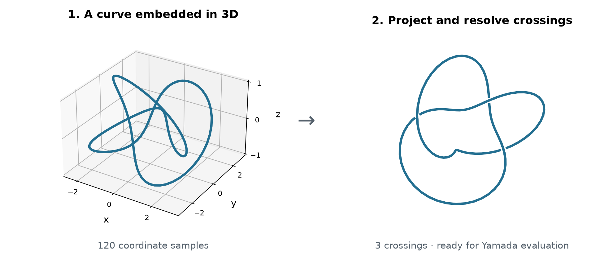

# KnottedGraph


[](https://hakanakgn.github.io/KnottedGraph/)

**KnottedGraph studies the topology of curves and graphs embedded in three
dimensions.** Build a graph from geometric data, inspect its projection and
compute its Yamada polynomial. Applications include molecular backbones,
mathematical knots, material surfaces and Hamiltonian models.

**[Website](https://hakanakgn.github.io/KnottedGraph/)** ·
**[Paper figures and downloadable data](https://hakanakgn.github.io/KnottedGraph/paper_results.html)** ·
**[Quick Start](#five-minute-quick-start)** · **[Install](#install-from-source)**

## Please cite our work

If you use KnottedGraph, please cite **[KnottedGraph: Scalable knotted-graph topology
for scientific and mathematical discovery](https://arxiv.org/abs/2609.31152)**
(Akgün, Yan, Liu, Chen and Lee, 2026).

For scientific applications to handlebody topology, Fermi-surface dispersions,
Lifshitz transitions and topological phase maps, please also cite
**[Topological classification through knotted graphs: Fermi surface dispersions
and Lifshitz transitions](https://arxiv.org/abs/2609.13390)**
(Akgün, Yan and Lee, 2026).

Copy the entries below, or [download the BibTeX file](CITATION.bib).

```bibtex
@misc{akgun2026knottedgraph,
  title={KnottedGraph: Scalable knotted-graph topology for scientific
         and mathematical discovery},
  author={Hakan Akgün and Xianquan Yan and Kehan Liu
          and Zhaoyun Chen and Ching Hua Lee},
  year={2026},
  eprint={2609.31152},
  archivePrefix={arXiv},
  primaryClass={cs.MS},
  url={https://arxiv.org/abs/2609.31152}
}

@misc{akgun2026topologicalclassificationknottedgraphs,
  title={Topological classification through knotted graphs:
         Fermi surface dispersions and Lifshitz transitions},
  author={Hakan Akgün and Xianquan Yan and Ching Hua Lee},
  year={2026},
  eprint={2609.13390},
  archivePrefix={arXiv},
  primaryClass={cond-mat.mes-hall},
  url={https://arxiv.org/abs/2609.13390}
}
```

## Install from source

Use Python 3.11 or newer and [uv](https://docs.astral.sh/uv/) to install the
**0.2.0 development API** used in the examples:

```bash
git clone --branch main --single-branch https://github.com/HakanAkgn/KnottedGraph.git
cd KnottedGraph
uv sync
```

The PyPI package is the legacy 0.1.2 release; use the source setup above for
this guide. The [installation page](https://hakanakgn.github.io/KnottedGraph/installation.html)
covers pip installation and extras for interactive plots, surfaces and notebooks.

## Five-minute Quick Start

Start with a trefoil embedded in 3D. The example below turns its coordinates
into a graph, finds the crossings in a fixed projection and evaluates the
normalized Yamada polynomial.



```python
import numpy as np
import sympy as sp

from knotted_graph.inputs import from_coordinate_chain
from knotted_graph.projection import compute_yamada_polynomial

t = np.linspace(0, 2 * np.pi, 120, endpoint=False)
points = np.column_stack([
    (2 + np.cos(3 * t)) * np.cos(2 * t),
    (2 + np.cos(3 * t)) * np.sin(2 * t),
    np.sin(3 * t),
])
graph = from_coordinate_chain(points, closure="direct").graph

Y = sp.Symbol("Y")
result = compute_yamada_polynomial(
    graph, Y, rotation_angles=(10, 20, 30),
    normalize=True, n_jobs=1, return_result=True,
)
print("Projection crossings:", result.projection.num_crossings)
print("Normalized Yamada:", result.polynomial)
```

Expected output:

```text
Projection crossings: 3
Normalized Yamada: -Y**11 + Y**9 + Y**8 + Y**7 - Y**4 - Y**3 - Y**2 - Y - 1
```

Run this example from the checkout with:

```bash
uv run python examples/quickstart.py
```

The [online Quick Start](https://hakanakgn.github.io/KnottedGraph/quickstart.html)
walks through the coordinates, over/under crossings and result, and shows how
to open an interactive 3D view or start from your own data.

## Explore the paper and its data

**[Open the online figure and data gallery](https://hakanakgn.github.io/KnottedGraph/paper_results.html)**
to view the paper's figures and download their supporting records directly
below each figure. No notebook execution is needed to browse the data.

| Explore | Direct entry point |
| --- | --- |
| All four main figures and eleven supplementary figures | [Online gallery](https://hakanakgn.github.io/KnottedGraph/paper_results.html) · [Repository guide](doc/paper_results.md) |
| Figure 4 and Supplementary Figure 10: 459 mixed-family cases, 324 short braid words and two length-101 checks | [Browse CSV/JSON data](User_guide/applications/results/figure4_suppfig10/README.md) · [Download complete data and source ZIP](doc/assets/data/figure4-suppfig10-source-data.zip) |
| Runtime comparisons and 4,400 handlebody cases | [Benchmark CSVs and interpretation](https://hakanakgn.github.io/KnottedGraph/benchmarks.html) |
| Small correctness checks with commands and expected results | [Sanity checks](https://hakanakgn.github.io/KnottedGraph/sanity_checks.html) |

Check the saved records without rerunning a scientific calculation:

```bash
uv run --no-project python scripts/inspect_paper_data.py
```

This standard-library command verifies file hashes and case alignment, then
summarizes the **112 saved scaling cases**, **4,400 handlebody cases**, and
the **Figure 4 / Supplementary Figure 10 data**.
See the [data inventory](User_guide/benchmarks/results/README.md) for direct CSV
links, timing definitions and the availability of the formula-discovery records.

### Published results at a glance

| Paper result | Saved evidence | Read the figure |
| --- | --- | --- |
| Exact published-polynomial checks through 500 crossings; 112 saved cases | [Scaling CSV](User_guide/benchmarks/results/03_knottedgraph_vs_topoly_scaling_rows.csv) | [Figure 3 and timing protocol](doc/benchmarks.md) |
| Normalized Yamada preserved in 4,400 accepted handlebody cases | [Preservation CSV](User_guide/benchmarks/results/handlebody_ground_truth/synthetic_ground_truth_yamada_preservation.csv) | [Supplementary Figures 6–7](doc/paper_results.md) |
| Per-stage timings with completed/timeout/error status retained | [Timing-figure CSV](User_guide/benchmarks/results/04_thick_handlebody_time_distribution_plot_source.csv) | [CSV columns and comparison rules](doc/benchmarks.md) |
| Formula and coefficient comparisons for mixed families and ordered braid words | [Figure 4 / Supplementary Figure 10 data](User_guide/applications/results/figure4_suppfig10/README.md) | [Figure panels and downloads](https://hakanakgn.github.io/KnottedGraph/paper_results.html#figure-4-discovering-and-testing-family-laws) |

[](https://hakanakgn.github.io/KnottedGraph/paper_results.html#figure-3-exact-evaluation-through-500-crossings)

*Figure 3 from [arXiv:2609.31152v1](https://arxiv.org/abs/2609.31152v1).
Open the [figure guide](doc/paper_results.md) for all 15 original PDFs, method
links and the availability of each result dataset.*

## Start here

Choose the row that matches the object you already have:

| I have / I want | First entry point | Continue to |
| --- | --- | --- |
| No existing data; I want a five-minute test | [`examples/quickstart.py`](examples/quickstart.py) | [Quick Start](https://hakanakgn.github.io/KnottedGraph/quickstart.html) |
| Ordered coordinates or CSV/DAT/JSON/NPY/TSV/TXT/XYZ | `knotted_graph.inputs.from_coordinate_chain` | [Input handling](https://hakanakgn.github.io/KnottedGraph/user_guide/input_adapters.html) |
| A PDB/mmCIF backbone | `from_pdb_backbone` / `from_mmcif_backbone` | [Input handling](https://hakanakgn.github.io/KnottedGraph/user_guide/input_adapters.html) |
| A GRO snapshot or first LAMMPS frame | `from_gromacs_gro` / `from_lammps_dump` | [Input handling](https://hakanakgn.github.io/KnottedGraph/user_guide/input_adapters.html) |
| Node and edge CSV files for a spatial graph | `from_spatial_graph_csv` | [Input handling](https://hakanakgn.github.io/KnottedGraph/user_guide/input_adapters.html) |
| A named knot/link, torus type, or braid word | `knotted_graph.inputs.KnotFunction` | [Analytic knot fields](https://hakanakgn.github.io/KnottedGraph/applications/analytic_knot_fields.html) |
| An embedded `networkx.MultiGraph` | `knotted_graph.core.ensure_embedding` | [Workflow overview](https://hakanakgn.github.io/KnottedGraph/user_guide/workflow_overview.html) |
| A nodal/material Hamiltonian in memory | application APIs under `knotted_graph.applications` | [Application routes](https://hakanakgn.github.io/KnottedGraph/applications/index.html) |
| A native Repulsor layout workflow | `knotted_graph.layout.repulsive` | [Repulsive layout](https://hakanakgn.github.io/KnottedGraph/user_guide/repulsive_layout.html) |

See the [input and workflow reference](https://hakanakgn.github.io/KnottedGraph/feature_status.html)
for the full list of readers and application routes. For material plots, the
[phase-map walkthrough](https://hakanakgn.github.io/KnottedGraph/applications/material_phase_maps.html)
starts with saved results and continues to small scan examples.

## The core mental model

<p align="center">
  
</p>

*Current architecture from the Overleaf manuscript (Supplementary Figure 11).
[Open the vector PDF](assets/paper/architecture.pdf).*

The shared object is an embedded graph: nodes carry 3D positions and edges
carry sampled curves. The same graph can be drawn, relaxed, projected and
analysed. Follow the [workflow guide](https://hakanakgn.github.io/KnottedGraph/user_guide/workflow_overview.html)
for the steps shown in the diagram.

## Documentation and help

Browse the [online documentation](https://hakanakgn.github.io/KnottedGraph/) for:

- [Input handling](https://hakanakgn.github.io/KnottedGraph/user_guide/input_adapters.html): load your coordinates, graph tables, structures or surfaces.
- [Projection and Yamada](https://hakanakgn.github.io/KnottedGraph/user_guide/projection_yamada.html): inspect a diagram and interpret its polynomial.
- [Application tutorials](https://hakanakgn.github.io/KnottedGraph/applications/index.html): explore knots, molecular data and material models.
- [API reference](https://hakanakgn.github.io/KnottedGraph/api/index.html): function signatures and examples.
- [Troubleshooting](https://hakanakgn.github.io/KnottedGraph/troubleshooting.html): resolve installation, input and display issues.

For notebooks, start with the [User Guide](User_guide/README.md) or
[application guide](User_guide/applications/README.md). Each notebook lists its
setup and expected runtime. Questions and reproducible bug reports are welcome
in the [GitHub issue tracker](https://github.com/HakanAkgn/KnottedGraph/issues).

Contributing documentation? See the
[documentation development guide](https://hakanakgn.github.io/KnottedGraph/developer/documentation.html).
